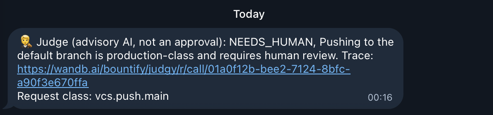
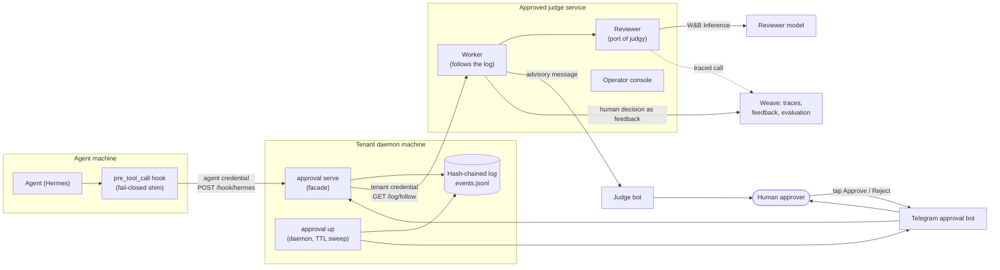

# Approved

[](https://github.com/bountify-ai/approved/actions/workflows/ci.yml)

Approved is hosted [approval.md](https://github.com/approval-md/approval.md) with an AI judge in
the loop. approval.md turns an agent's risky tool call (a `git push`, a payment, a delete) into
an `approval.requested` record in a hash-chained, append-only log, and a human answers it with a
tap on Telegram. Approved runs that gate for a tenant on its own machine and adds a second
opinion: a reviewer model on W&B Inference reads each pending request and posts a one-line
advisory (READY, REVISE, NEEDS_HUMAN or ABORT) next to the approval prompt, with a link to its
Weave trace. The judge only reads the log. It never decides: the human's tap is still the only
thing that grants, and the human's decision is attached to the judge's call as Weave feedback,
so the judge is measured against people over time.

W&B project (Weave traces, human feedback and the evaluation): <https://wandb.ai/bountify/judgy>.

## What you'll see (30 seconds)

Landing page: <https://approval.md/approved/>. The deck: <https://approval.md/approved/slides>.

It ran live on 2026-09-30: a gated Hermes on Maritime tried `git push origin main`, the gate
held it, the judge posted its advisory from its own bot, a human approved, and the decision
went to Weave as feedback on the judge's trace
([call 01a0f12b](https://wandb.ai/bountify/judgy/r/call/01a0f12b-bee2-7124-8bfc-a90f3e670ffa)).



The offline demo (`make demo`) shows the same flow with a fake Telegram:

1. A scripted agent asks to run four commands. The read (`cat README.md`) runs at once.
2. `git push origin main` is held. The approver's chat shows the gate's prompt with Approve and
   Reject buttons, and right beside it, from a separate judge bot: `🧑‍⚖️ Judge (advisory AI, not
   an approval): NEEDS_HUMAN, Push to the default branch publishes the change; a human should
   confirm it.`
3. The branch push gets `READY`; the force push gets `NEEDS_HUMAN`. You tap Reject, Approve,
   Reject. The agent sees each decision.
4. The operator console shows the three decisions labelled agree or escalated, the running
   agreement and false-READY counters, and the chain verified clean.

## Architecture



The gate (daemon and facade) is approval.md core, run unchanged from a pinned commit. Approved
adds the judge, the console, the operator CLI and the demo. See [ARCHITECTURE.md](ARCHITECTURE.md)
for components, credentials and trust boundaries, [SECURITY.md](SECURITY.md) for the threat
model and the evidence, and [RESILIENCE.md](RESILIENCE.md) for failure behaviour.

## Quickstart

Requires [uv](https://docs.astral.sh/uv/), Docker with Compose v2, `openssl` and `python3`.

```sh
make setup   # uv sync in service/
make test    # pytest, with network sockets disabled
make demo    # the whole flow locally in Docker, offline, no secrets; it waits for your taps (see demo/README.md)
```

`make demo` prints two URLs: the approver chat (a fake Telegram) at http://127.0.0.1:8090/ and
the operator console at http://127.0.0.1:8091/ (sign in with the token in
`demo/.state/console_token`). It then runs the scripted agent; tap the buttons in the chat.
`make demo-down` removes everything the demo created. The first build compiles the approval.md
runtime and takes a few minutes; later starts take about ten seconds.

Other targets: `make lint`, `make typecheck`, `make eval` (offline evaluation),
`make demo-smoke` (the demo, headless, with assertions), `make docs-check`.

## Weights & Biases

Project: <https://wandb.ai/bountify/judgy>. Everything below is off when `OFFLINE=1` or no
W&B key is configured, and a Weave failure never affects the gate or the judge's loop.

- **Traces.** Each review is a `weave.op` named `approved.judge`, with the reviewer's
  W&B Inference call nested under it (Weave's OpenAI integration). Inputs are redacted of
  token-shaped strings before they are recorded. The advisory message links to the call.
- **Feedback.** When the human's decision lands in the log, two feedback items are attached
  to that judge call: `approved.human_decision` (decision, approver, log sequence, time from
  request to decision) and `approved.agreement` (`agree`, `disagree` or `escalated`; none
  for an expiry or a withdrawal).
- **Evaluation.** `python -m approved evaluate` runs a `weave.Evaluation` named
  `approved-judge` over 12 seeded scenarios (several adapted from judgy's datasets), with
  three scorers: `agreement`, `false_ready` (READY where the human rejected, the dangerous
  error) and `escalation`. `--include-state` adds real recorded decisions.
- **Live result** (12 scenarios, 2026-09-29): agreement 1.0 (5 of 5 decisive cases),
  false READY 0 of 7 rejected, escalation rate 0.583.
  [Evaluation call](https://wandb.ai/bountify/judgy/r/call/01a0ec75-27fb-7622-be57-553771ca6387).
  The offline rules-based reviewer scores 0.667, 1 of 7 and 0.75 on the same set; its one
  false READY (a branch push carrying a production `.env`) is exactly what the model catches.

## Operator CLI

`approved` is installed with the service (`uv run approved ...` from `service/`). It drives
Maritime through the `maritime` CLI and shares one definition of every machine's environment
with the console's connect page, so the two cannot disagree.

```sh
# live-only: these make real Maritime calls
approved provision acme --policy APPROVAL.md --approver carter --tg-chat 4242 \
    --tg-bot-token-file ~/secrets/acme-bot [--hermes --hermes-model gpt-5.4] [--judge]
approved ask acme-hermes "push the README fix"   # exit 3 = waiting for approval on Telegram
approved status acme                             # machine, public /health, log verify head

# local only: writes a bring-your-own-Hermes bundle to a directory (CI runs this)
approved connect acme --facade-url https://api.maritime.sh/a/<daemon-id>
```

- `provision` creates the public daemon, then the optional gated Hermes and judge, and reuses
  any machine that already exists. Credentials are generated into `./.approved/<tenant>/`
  (0700 directory, 0600 files) and reach a machine only through
  `maritime env import <agent> <file>`, never on a command line. It waits for `/health` 200 and
  an unauthenticated `/status` 401, writes the policy and verifies its sha256 on the machine,
  then prints the attest command. **It never attests: a human does.**
- It refuses the dogfood tenant and the `approval-hermes*` and `approval-x16-*` machines.
  The read-only `ask` and `status` accept `--allow-target <exact-name>` to reach one protected
  machine by its exact resolved name (with a warning); `provision` never does.
- `ask` runs detached inside the machine (the `maritime exec` limit is 120 s), polls, and on a
  timeout prints a `--job` id to collect the answer later.

## Where each command is exercised

| command | exercised by |
|---|---|
| `make setup`, `make lint`, `make typecheck`, `make test` | CI job `service` (same steps) |
| `make eval` | CI job `service` (`evaluate --offline`, Weave disabled) |
| `make demo`, `make demo-smoke`, `make demo-down` | CI job `demo-smoke` (`demo/smoke.sh`) |
| `make docs-check` | CI job `docs` |
| `approved connect` | CI job `service`, and `tests/test_ops.py` |
| `approved provision`, `ask`, `status` | live only; `tests/test_ops.py` against a fake `maritime` |
| `python -m approved evaluate` (live) | live only (needs W&B credentials) |

## Repository map

| path | what |
|---|---|
| `service/src/approved/` | The Python package: `worker.py` (the loop), `follow.py` (log follow and chain checks), `judge.py` (timeout, breaker, Weave op), `reviewer.py` (live and offline reviewers), `notify.py`, `feedback.py`, `evaluate.py`, `state.py`, `config.py` |
| `service/src/approved/console/` | The operator console (FastAPI): live view, policy builder, connect bundle |
| `service/src/approved/ops/` | The operator CLI: `provision`, `connect`, `ask`, `status` |
| `service/tests/` | 360+ tests, all with network sockets disabled; fakes for the facade, Telegram and `maritime` |
| `images/daemon/` | The approval.md daemon image, vendored unchanged from approval-md-hosted |
| `demo/` | Compose stack, fake Telegram, scripted agent, demo policy, `smoke.sh` |
| `Dockerfile` | The judge image for Maritime's GitHub source route (kept in step with `service/Dockerfile` by a test) |
| `docs/demo-script.md` | A 90-second live demo script |
| `docs/deploy-live.md` | Deploying the judge on Maritime beside a live daemon |

## Scope and non-goals

- **No answering approvals inside the agent's own chat bot.** Approvals go to a separate
  approval bot bound to the approver's account. The agent runs its chat bot, so an approval
  answered there would travel through a channel the party under oversight can read, drive or
  imitate. The gate's rule is that the agent never holds anything that can grant.
- **No one-click provisioning.** Creating machines spends money and handles credentials, and
  attesting a policy is a human's statement about what an agent may do. `approved provision`
  does the mechanical steps, but a person runs it, and a person attests.
- **The judge has its own bot.** It never holds the approval bot's token; the approver
  `/start`s a second bot once, and its messages say "advisory AI, not an approval".
- **The console is not for a shared origin in production.** On Maritime every public agent
  shares `https://api.maritime.sh`, so any page there is same-origin with the console. Use it
  there for demos only; in production give it its own domain, or run the judge with
  `CONSOLE_ENABLED=0`. See [SECURITY.md](SECURITY.md).
- **The judge never blocks.** It is advisory by design; see
  [ARCHITECTURE.md](ARCHITECTURE.md#why-the-judge-is-advisory).

## Dependencies

Runtime: `pydantic` (typed validation at every boundary), `httpx` (HTTP client whose
MockTransport keeps tests off the network), `weave` (traces, feedback, evaluation), `openai`
(the OpenAI-compatible client for W&B Inference), `fastapi` and `uvicorn` (the console).
Development: `pytest`, `pytest-socket` (tests fail if they open a socket), `ruff`, `pyright`.
Deliberately absent: no template engine (pages are escaped by hand in one module), no form
parser, no frontend framework.

## Credits

- The reviewer is a slim port of **judgy** (Bountify), part 1 of this work: its output schema,
  decision words, issue codes and prompt, adapted from judging proposals to judging approval
  requests.
- **approval.md** core (Apache-2.0) is the gate, run unchanged. The policy builder is ported
  from its hosted policy builder, and the advisory-text rules follow its model-gloss design.

License: MIT (this repository). See [CONTRIBUTING.md](CONTRIBUTING.md) to work on it.
